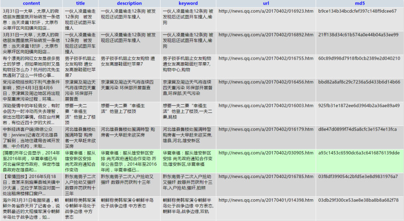
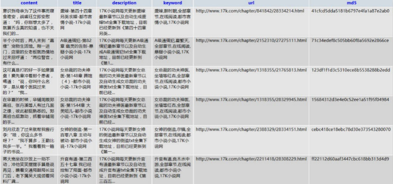

# 功能介绍

智能解析网页文章爬虫，通过给定起始URL，爬虫将会自动爬取与其相关的网页，并解析文章标题，描述，关键字，内容并将解析结果存放到Mysql数据库。**仅作学习测试使用。**

# 设计思路

## ArticalSpider.py
智能解析文章模块

 - 对于标题，描述，关键词的爬取采用正则TAG方式得到
 - 对于正文，参考于 [基于行块分布函数的通用网页正文抽取算法](https://code.google.com/p/cx-extractor)，在此基础上，重写TAG清除模块，取消通过行块密度判断正文的方式，而是通过计算正文置信度分数判断，并以置信度最高的行块向两边行块拓展得到最终的行块

## SQLManager.py & CreateTable.py
数据库管理模块

 - 采用ORM操作数据库
 - 表中含有 *content（正文）*，*title（标题）*，*description（描述）*，*keyword（关键字）*，*url（文章链接）*，*md5（url加密得到，用于唯一标识）*

## ArticalSpider.py
1. 读取.conf配置文件，初始化智能解析，数据库模块，协程池
2. 初始化已解析URL字典（从数据库读取所以md5信息，保存本地字典，用于判重）
3. 初始化URL队列
	 - 若本地存储上次保留的URL信息，则载入
	 - 加载.conf中的起始URL
4. 当所有初始化配置完毕后发出事件通知所有等待协程开始爬取
5. 在爬取过程中，将新增URL存入队列尾部，对于每个队列弹出的URL，直接进行解析插入数据库
6. 在爬取过程中定时序列化保存URL队列的数据以便下次重启爬虫恢复数据，同时debug信息将会存在同一目录

**虽然协程的切换消耗较小，但是如果为每个URL创建greenlet仍然不是最优的办法。为了减少协程的切换，对每个worker使用while循环保证仅当URL队列被阻塞才退出（因为是有界队列，所以实际上基本是因为q.put()的阻塞而退出）**


# 设计与问题

基本功能已经实现完成，具有初步的爬取能力。但仍有许多不完善的地方。诸如：

 - 对于新加入的URL采用有界队列存放，且不在边界进行阻塞（若阻塞会导致整个进程阻塞，主逻辑如下，由于每个界面会有若干个URL，除非对于每个获取的url创建一个线程，否则有限个线程必定会阻塞）
	 
	```python
	while True:
		q.get()
		
		for url in findAllUrls:
			q.put()  # all threads block
	```

	而不阻塞会导致一些URL的丢失，这一块并没有任何优化措施。
	  
 - 由于爬虫采用广度优先搜索，对于某些小说网的可爬取链接深度较深，当有界队列的容量设的较小的时候易提前终止爬虫。

对于这类问题，目前尽量减少影响的办法就是在配置文件data.conf中将maxUrlQueueSize（URL队列容量）尽量设置的较大或者尝试无界队列。而对于另一问题即重启爬虫对于已搜索URL的处理如下：

 - 因为存在URL丢失的问题，所以仅将插入数据库的URL作为已搜索URL集合
 - 间隔一定时间对有界队列的URL进行磁盘保存以便重启恢复

除了这些问题，还有如 *文章内容，标题解析算法* ，*请求重连* ， *反爬虫网站的处理* ， *高并发导的服务器拒绝连接* 等问题只进行了初步的处理。由于技术水平以及时间问题，该爬虫还有许多可进行优化的地方，使用时请仔细斟酌。

# 环境搭建
```
# win
pip install virtualenv virtualenvwrapper-win

# linux
pip install virtualenv virtualenvwrapper
```

```
# 创建虚拟环境
mkvirtualenv ArticalSpider -p python3

# 确保在虚拟环境下安装所需库
pip install chardet
pip install gevent
pip install requests
pip install SQLAlchemy
pip install PyMySQL

# 若已经退出，可通过workon重新激活
workon ArticalSpider
```

# 使用

 1. 在Mysql中创建名为 *Test* 的数据库
 2. 配置 *data.conf* 文件
 
	 ```
	 maxUrlQueueSize: 有界队列可存放的最大URL数
	 poolSize：协程池最大同时激活greenlet数
	 urlQueueFileName：定时存放队列中URL到本地的文件名
	 startUrls：爬虫运行起始URL
	 filterUrlsRegular：用于过滤的URL，如果设置为空则不过滤任何URL，否则将只捕捉指定含有该值的的URL（如：设置了filterUrlsRegular为http://news.qq.com/，那么将只捕捉该域名下的URL）
	 saveTime：定时保存队列URL信息（单位为秒）
	 mysql：数据库信息
	 ```
 3. 运行 *CreateTable.py* 
 
	 ```
	 python CreateTable.py
	 ```
 4. 运行 *ArticalSpider.py* 
 
	 ```
	 python ArticalSpider.py
	 ```

# 效果
默认配置为爬取腾讯新闻，测试15分钟共爬取1050条数据进入数据库



也测试了一些不具有反爬机制的小说网站，由于前文提到深度过深以及URL丢失问题，爬取速度较慢



# PS
爬虫仅测试了少量的网站，具体使用效果请参考实际使用情况
 

